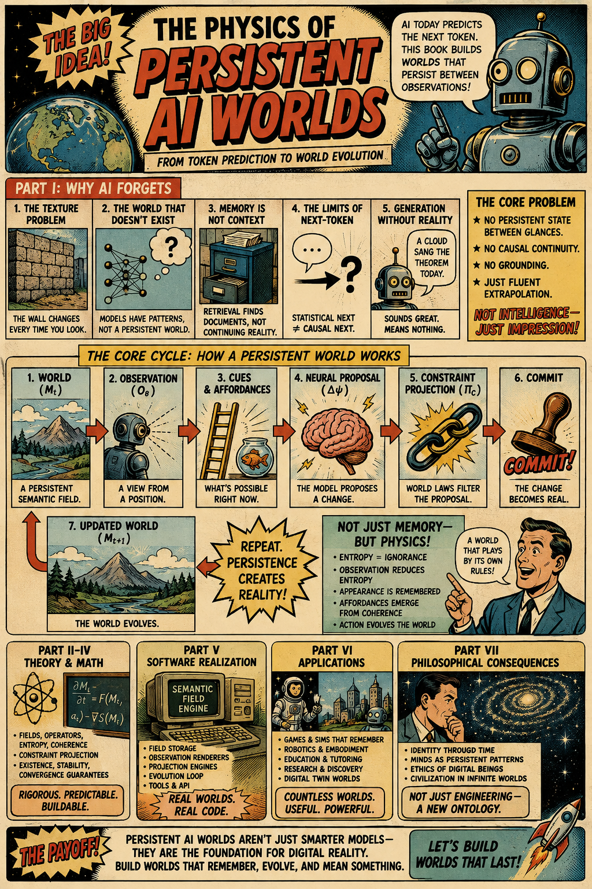

[Building Forth from Spherepop Primitives](https://standardgalactic.github.io/memory/building-forth.pdf)
<!--
* [The Monotonic Ledger](https://standardgalactic.github.io./memory/The_Monotonic_Ledger.pdf)
-->

[A Viability Theory of Fusion Reactors](https://standardgalactic.github.io/memory/fusion-viability.pdf)
<!--
* [Engineering Fusion Persistence](https://standardgalactic.github.io./memory/Engineering_Fusion_Persistence.pdf)
-->

[Persistent Generative Worlds](https://standardgalactic.github.io/memory/persistent-generative-worlds.pdf)
<!--
* [The World Engine](https://standardgalactic.github.io./memory/The_World_Engine.pdf)
-->

[Beyond Optimal Foraging](https://standardgalactic.github.io/memory/beyond-optimal-foraging.pdf)

* [Micromegas Visualizer](https://standardgalactic.github.io/memory/micromegas/visualizer.html)

